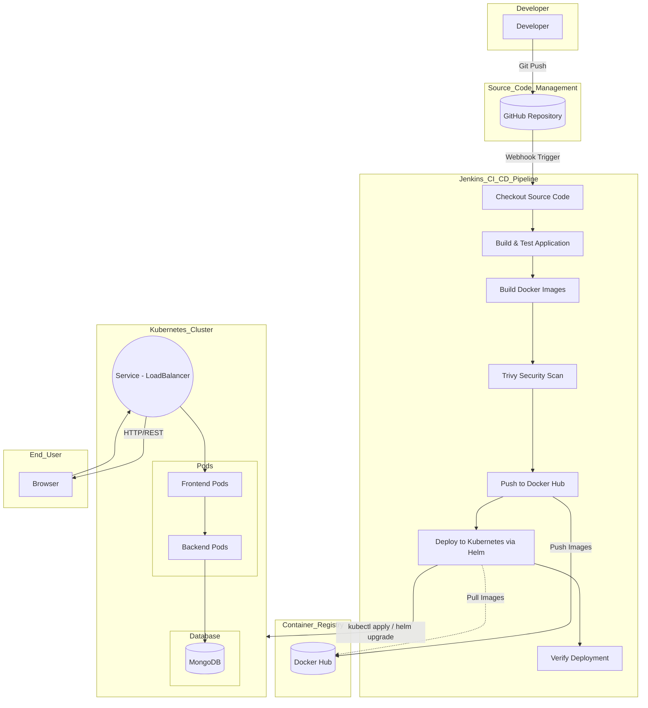

# Smart Event Management Portal - Architecture Diagram

This diagram visualizes the complete DevOps CI/CD pipeline from code push to deployment on the Kubernetes cluster.

```mermaid
flowchart TD
    subgraph Developer
        A[Developer]
    end

    subgraph Source_Code_Management
        B[(GitHub Repository)]
    end

    A -- "Git Push" --> B

    subgraph Jenkins_CI_CD_Pipeline
        direction TB
        C[Checkout Source Code]
        D[Build & Test Application]
        E[Build Docker Images]
        F[Trivy Security Scan]
        G[Push to Docker Hub]
        H[Deploy to Kubernetes via Helm]
        I[Verify Deployment]
        
        C --> D
        D --> E
        E --> F
        F --> G
        G --> H
        H --> I
    end

    B -- "Webhook Trigger" --> C

    subgraph Container_Registry
        J[(Docker Hub)]
    end

    G -- "Push Images" --> J
    H -. "Pull Images" .-> J

    subgraph Kubernetes_Cluster
        direction TB
        K((Service - LoadBalancer))
        
        subgraph Pods
            L[Frontend Pods]
            M[Backend Pods]
        end
        
        subgraph Database
            N[(MongoDB)]
        end

        K --> L
        L --> M
        M --> N
    end

    H -- "kubectl apply / helm upgrade" --> Kubernetes_Cluster

    subgraph End_User
        O[Browser]
    end

    K -- "HTTP/REST" --> O
    O --> K
```
